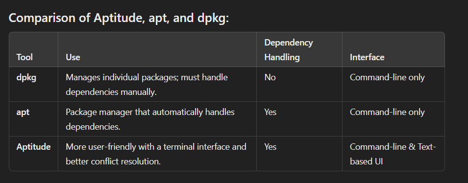
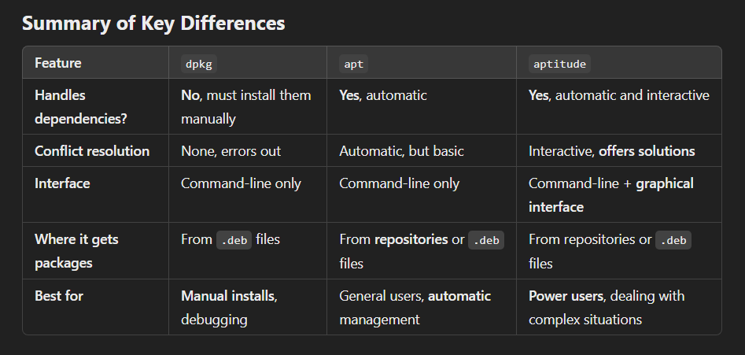
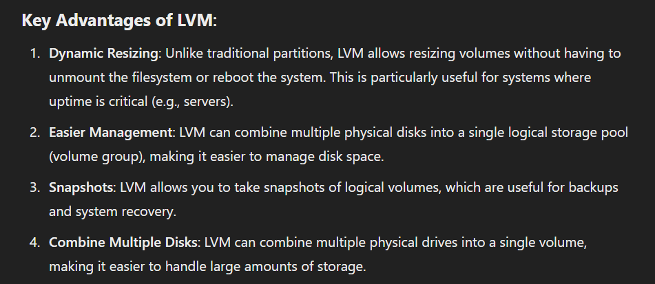
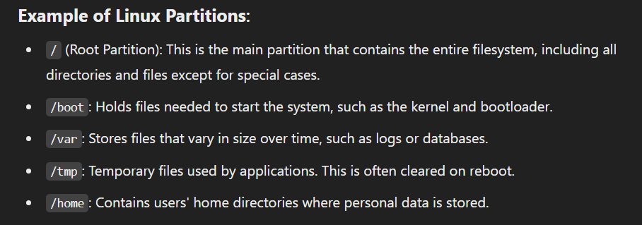
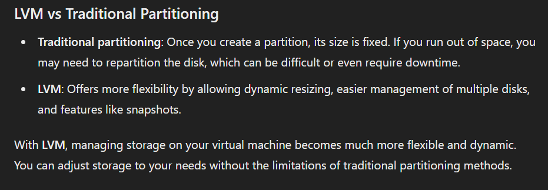

let's go deeper into what you specifically need to know for the **Born2beroot** project and why it's called that.

### **What is the Born2beroot Project?**

The **Born2beroot** project is a system administration exercise designed to teach you about Linux (and/or other UNIX-like systems such as Rocky Linux for some cases) while building a strong foundation in server management and security. The goal is to help you develop a deeper understanding of how operating systems, users, permissions, firewalls, and automated tasks work at a fundamental level.

### **Why is it called Born2beroot?**

The project’s title, **Born2beroot**, refers to becoming a **root user** or superuser in a Linux system. The "root" user has **complete control** over the operating system, and gaining this control requires deep knowledge of how the system works. In the project, you are essentially learning to manage a system as a root user from scratch, which might also involve configuring tasks that make the system "reboot" (restart or reset itself). Hence, the title is a play on words:

- **Born**: This refers to the fact that you're starting from the beginning—learning to manage a system from the basics.
- **Root**: Refers to the root user (the superuser) who has full privileges over the system.
- **Boot/Reboot**: "Boot" refers to the process of starting the operating system, and "reboot" means restarting the system. This project teaches you to set up a system that can run securely and efficiently, even when it boots or reboots, like a real server.

### **What Does Boot/Reboot Mean?**

- **Boot**: This is the process your system goes through when it powers on. It loads the operating system into memory, allowing you to use the system.
- **Reboot**: This is simply restarting the system, which involves shutting it down and then booting it back up.

In this project, you'll often hear these terms because setting up a **Linux server** (whether it's on a virtual machine or a real server) requires that it can boot and reboot properly, maintain its security, and stay operational after each restart. You need to ensure that essential services (like SSH, cron jobs, firewall rules, etc.) run automatically after a reboot.

### **What You Need to Know for Born2beroot**

1. **Operating System Installation**:
   - **Ubuntu** (for most) or **Rocky Linux** (in some cases).
   - Understanding **hypervisors** (like VirtualBox) and how to use a **virtual machine** to run the OS inside another operating system (like Windows).
   
2. **System Administration**:
   - Learn to manage users, groups, and permissions, especially using `sudo`.
   - Understand how to configure a firewall using **UFW** (Ubuntu) or **Firewalld** (Rocky Linux).
   - Set up **SSH** to securely access the server remotely, using a non-root user and ensuring only specific ports are open.
   
3. **Partitioning & LVM**:
   - Use **LVM** (Logical Volume Management) during OS installation for flexible disk management. This gives you control over how disk space is allocated and resized.
   
4. **Security & Firewall**:
   - Learn to configure and manage firewall rules using UFW (or Firewalld for Rocky Linux).
   - Ensure **SSH** is only accessible on a custom port (like 4242) and make sure root login is disabled.

5. **Automated Tasks (cron)**:
   - Use **cron jobs** to automate tasks on your server. For example, you could run a script every 10 minutes to monitor system status.

6. **Understanding the Boot Process**:
   - You’ll need to understand how to configure your server so that when it reboots, all essential services start up automatically, including your firewall and SSH services.
   
7. **Script Management**:
   - You may need to write a **script** (e.g., a monitoring script that sends messages with `wall` to users). The script should start automatically when the system boots, and you should know how to schedule it using cron.

### **Key Points You Should Be Able to Explain**:

- **Cron**: This is a tool for scheduling tasks (e.g., a script that runs every minute).
- **Firewall (UFW/Firewalld)**: Firewalls help secure your system by controlling which ports are open to the outside world.
- **SSH**: A protocol for secure remote access to your machine. You'll configure it to only allow access via specific ports.
- **Root & sudo**: The **root** user has full control of the system, while `sudo` allows other users to execute commands with elevated privileges.

---

### **To Summarize the Born2beroot Journey**:

- **Objective**: You’re learning how to set up and manage a secure, stable Linux server from scratch.
- **Booting and Rebooting**: It's crucial that your server runs properly every time it starts up (boots) or restarts (reboots), keeping all essential services running and secured.
- **Root User**: You’re gaining experience managing the system as a root user and understanding how to handle tasks that affect the whole system.
- **Security**: Configuring firewalls, SSH access, and user permissions is a huge part of the project to ensure that your system is secure.

This project essentially makes you "born" to manage a Linux system as a root user, teaching you the essential skills to handle a live, secure server that can boot and reboot with all configurations intact.


Got it! You want a detailed explanation, step by step, of how to set up a virtual machine (VM) on your PC, covering key concepts like operating systems (OS), virtualization, hypervisors, partitioning (LVM), and user management (including `sudo`). I'll present this as a journey, starting from setting up your PC, installing a VM, and going through different system administration tasks.

---

### **The Story of Setting Up a Virtual Machine and Managing It**

Imagine you're on a quest to turn your PC into a flexible system that can run multiple operating systems and manage tasks efficiently. You’ve decided to install **Ubuntu** on a **virtual machine** (VM) while still using **Windows**. Let’s explore this journey together.

#### **Chapter 1: Understanding Why You Want a Virtual Machine**

Your PC currently runs **Windows**, and while it’s great for everyday tasks, you want to explore **Linux**—particularly **Ubuntu**—because:
1. **Linux Environment**: It’s preferred by developers and sysadmins for its powerful command-line interface.
2. **Security**: Linux offers better control over system security.
3. **Learning Opportunity**: You want to enhance your knowledge in system management, scripting, and automation.

But, you don’t want to uninstall Windows. This is where a **virtual machine** comes in. A VM allows you to run Ubuntu inside Windows without removing your current OS.

#### **Chapter 2: Installing a Virtual Machine (VM)**

To set up a virtual machine, you’ll use a **hypervisor**. A hypervisor is software that allows multiple operating systems to share a single hardware host.

1. **Choose Your Hypervisor**:
   - You can use **VirtualBox** or **VMware**. Both are great options for running virtual machines on Windows.
   
2. **Install the Hypervisor**:
   - Download and install **VirtualBox** from the official website.
   - Follow the setup instructions to install it on your Windows machine.

3. **Download Ubuntu ISO**:
   - Head over to Ubuntu’s official website and download the latest **Ubuntu ISO** file.
   
4. **Create a New Virtual Machine**:
   - In VirtualBox, click on "New" to create a new virtual machine.
   - Choose a name, select **Linux** as the type, and pick **Ubuntu**.
   - Allocate memory (RAM) to the VM (e.g., 2 GB).
   - Create a virtual hard disk, usually around 20 GB.

5. **Load the Ubuntu ISO**:
   - When setting up your VM, VirtualBox will ask you to load the **Ubuntu ISO** file. This will act like a virtual CD to install Ubuntu.
   - Start the VM and follow the installation instructions for Ubuntu.

#### **Chapter 3: Introduction to the Hypervisor**

The hypervisor you’re using—**VirtualBox**—creates an environment where Ubuntu can run as if it’s on real hardware, but it shares your PC’s CPU, memory, and disk space with Windows.

- **Type 2 Hypervisor**: VirtualBox is a **Type 2 hypervisor**, meaning it runs on top of an existing OS (Windows in this case).
- **Virtual CPU, RAM, and Storage**: The hypervisor allocates a portion of your PC's resources to the VM. You can manage this allocation to suit your needs.

#### **Chapter 4: Setting Up Logical Volume Management (LVM)**

When installing Ubuntu inside the VM, you’ll come across an option for **LVM** (Logical Volume Management). LVM is a method of managing disk space more flexibly than traditional partitioning.

- **Why Use LVM?**
  - It allows you to resize partitions easily without shutting down your machine.
  - You can combine multiple hard disks into one large logical volume, which can be resized dynamically.

- **How to Set It Up**:
  - During Ubuntu installation, choose the **LVM** option when partitioning the disk.
  - This will allow you to create flexible partitions, which are useful if you plan on expanding storage later.

#### **Chapter 5: Introducing the `sudo` Program**

Once Ubuntu is installed on your virtual machine, it’s time to understand **sudo**. 

- **What is `sudo`?**
  - `sudo` stands for "superuser do" and is used to execute commands with elevated privileges (like admin/root permissions).
  - It allows you to perform administrative tasks, such as installing software, without logging in as the root user (which could be risky).

- **Example**:
  To update your Ubuntu system, you would run:
  ```bash
  sudo apt update
  sudo apt upgrade
  ```

- **Why Use `sudo`?**
  - It provides a controlled way to execute important commands, ensuring that only authorized users can perform system-critical actions.

#### **Chapter 6: Managing User Permissions and Groups**

Your next task is managing users and their privileges on your Ubuntu system.

1. **Adding Users**:
   - You can create a new user using:
     ```bash
     sudo adduser newusername
     ```

2. **Creating a Group**:
   - Let’s say you need to create a group named `evaluating` for your user.
     ```bash
     sudo groupadd evaluating
     ```

3. **Assign the User to a Group**:
   - To assign the new user to the `evaluating` group:
     ```bash
     sudo usermod -aG evaluating newusername
     ```

4. **Checking Group Membership**:
   - You can verify the group membership using:
     ```bash
     groups newusername
     ```

#### **Chapter 7: Setting Up Firewall and SSH**

Now, you’ll secure your system by configuring **UFW** (Uncomplicated Firewall) and **SSH** (Secure Shell):

1. **Install UFW**:
   - UFW helps manage firewall rules.
     ```bash
     sudo apt install ufw
     ```

2. **Activate UFW**:
   - Enable the firewall and allow certain ports, such as for SSH (port 22):
     ```bash
     sudo ufw enable
     sudo ufw allow 22
     sudo ufw allow 4242
     ```

3. **Set Up SSH**:
   - SSH allows remote access to your machine. Install and configure it to use only port 4242 (instead of the default port 22):
     ```bash
     sudo apt install openssh-server
     sudo nano /etc/ssh/sshd_config
     ```
     - Change `Port 22` to `Port 4242` in the SSH config file, save it, and restart the SSH service:
     ```bash
     sudo systemctl restart ssh
     ```

4. **Logging in with SSH**:
   - You can now log into your Ubuntu VM from another machine using:
     ```bash
     ssh username@yourIP -p 4242
     ```

#### **Chapter 8: Automating Tasks with Cron**

Finally, you want to automate some tasks using **cron**.

- **What is cron?**
  - **cron** is a task scheduler in Linux. It allows you to run scripts or commands at specific intervals, such as every 10 minutes or once a day.

- **How to Set Up a cron Job**:
  - Let’s say you want to create a cron job that runs every 10 minutes.
    ```bash
    crontab -e
    ```
  - Add the following line to run a script every 10 minutes:
    ```bash
    */10 * * * * /path/to/your/script.sh
    ```

#### **Chapter 9: The Power of Wall Command**

Before we conclude, there’s one more command to know: **wall**.

- **What is wall?**
  - The `wall` command allows you (as root) to send a message to all logged-in users on the system. It’s typically used to announce important system events, like reboots.
  - Example:
    ```bash
    sudo wall "The system will reboot in 10 minutes. Save your work."
    ```

---

### **Epilogue: Reflecting on Your Journey**

You’ve now learned how to:
- Set up and run Ubuntu on a VM using VirtualBox.
- Understand and use LVM for flexible disk management.
- Manage users and groups using `sudo`.
- Secure your system with UFW and SSH.
- Automate tasks with cron and communicate using the `wall` command.

Each step has given you deeper control over your system, turning your PC into a powerful, flexible tool for development and system administration.

--- 

--- 

Let's say you're a developer working on a Linux project, but your main computer runs Windows. Instead of dual-booting (which requires restarting the computer to switch between operating systems), you can run Linux in a VM. You use a tool like VirtualBox to create the VM, and you install Linux inside it. Now, you can use Linux within a window on your Windows desktop without restarting your machine.
Here’s how everything ties together:

Your physical machine runs the host OS (e.g., Windows or macOS).
The host OS runs a hypervisor (like VirtualBox) that creates and manages virtual machines.
Inside a VM, you can install a guest OS (like Linux) and use it to experiment, develop, or perform tasks without affecting the host OS.
##### apt aptitude dpkg: package managment tools

### What is `aptitude`?

**`aptitude`** is another package management tool used in Debian-based systems (like Ubuntu), just like **`apt`** and **`dpkg`**. It is **more user-friendly** and offers both a **command-line interface (CLI)** and a **graphical interface** for managing packages. With `aptitude`, you can do everything that `apt` and `dpkg` do—install, update, remove packages, and resolve dependencies—but it also provides some advanced features and a **nicer user experience**.

Think of `aptitude` as a more **intelligent and interactive** version of `apt`.

---

### **Using `aptitude`**

Just like `apt` or `dpkg`, you can use `aptitude` to install packages, but with some improvements:

- It automatically **suggests solutions** if there are problems with dependencies, offering choices to fix the issue (e.g., by upgrading, removing, or holding certain packages).
- It offers an **interactive interface** (both text-based and graphical), where you can **navigate menus**, view package details, and select packages to install or remove.
  
Here’s an example command to install a package with `aptitude`:

```bash
sudo aptitude install app-a
```

If a dependency is missing or conflicting, `aptitude` will often **ask you what to do** and give **suggestions**. It might say something like:

```
App A has unmet dependencies. Do you want to:
1. Install the missing dependencies
2. Remove conflicting packages
3. Ignore and proceed
```

This makes managing packages **easier and smarter**, especially when things get complex.

---

### **Differences Between `dpkg`, `apt`, and `aptitude`**

Let’s break it down, step-by-step:

#### 1. **`dpkg`**: The Most Basic Tool (Manual)
- **What it does**: Installs `.deb` packages directly.
- **Does it handle dependencies?**: **No**. You must manually install each dependency if it’s missing.
- **How to use it**:
  - You use it to install a package:
    ```bash
    sudo dpkg -i package.deb
    ```
  - If there are missing dependencies, you manually install them.

#### 2. **`apt`**: The Standard Package Manager (Automatic)
- **What it does**: Installs packages from **online repositories** or `.deb` files, handling both package installation and dependencies.
- **Does it handle dependencies?**: **Yes**. It **automatically** installs any missing dependencies for you.
- **How to use it**:
  - You install a package with:
    ```bash
    sudo apt install package
    ```
  - **`apt`** finds and installs all required dependencies.

#### 3. **`aptitude`**: The Advanced, User-Friendly Tool (Interactive)
- **What it does**: Installs packages like `apt`, but with **smarter features**. It’s more **interactive** and provides **better conflict resolution**.
- **Does it handle dependencies?**: **Yes**. Just like `apt`, it automatically installs dependencies, but if there are any conflicts or issues, it offers **suggestions** and gives you **choices** on how to fix them.
- **How to use it**:
  - You install a package with:
    ```bash
    sudo aptitude install package
    ```
  - If there’s a problem with dependencies or conflicts, `aptitude` asks you for input, offering **solutions** to fix it.

---

### **Summary of Key Differences**

| Feature                   | `dpkg`                            | `apt`                             | `aptitude`                         |
|---------------------------|-----------------------------------|-----------------------------------|-----------------------------------|
| **Handles dependencies?**  | **No**, must install them manually | **Yes**, automatic                 | **Yes**, automatic and interactive |
| **Conflict resolution**    | None, errors out                 | Automatic, but basic              | Interactive, **offers solutions**  |
| **Interface**              | Command-line only                | Command-line only                | Command-line + **graphical interface** |
| **Where it gets packages** | From `.deb` files                 | From **repositories** or `.deb` files | From repositories or `.deb` files |
| **Best for**               | **Manual installs**, debugging   | General users, **automatic** management | **Power users**, dealing with complex situations |

---

### Conclusion

- **Use `dpkg`**: When you have a specific `.deb` file and want to install it **manually**, but be prepared to handle dependencies yourself.
- **Use `apt`**: For day-to-day package management, especially when you want a **simple, automatic** way to install and manage packages, including dependencies.
- **Use `aptitude`**: If you want more control, especially when dealing with **complex** or **conflicting packages**. It gives you **suggestions** and lets you interact with the process more.

Each tool has its strengths depending on your needs!



##### AppArmor:
**AppArmor** is a security framework for Linux that restricts what applications (programs) can do. It acts like a protective shield, ensuring that even if a program is compromised, it cannot cause widespread damage.

### How It Works:
**Profiles:** AppArmor uses profiles to define what actions a program can and cannot perform. For example, it can restrict a web server from accessing sensitive files or running certain commands.
**Modes:**
Enforcing Mode: Actively blocks actions that violate the profile rules.
Complain Mode: Logs violations without blocking them (useful for testing).
### Why Use It:
AppArmor limits the damage an attacker can cause if they exploit a program. It ensures that even if a program is compromised, its ability to access files, run commands, or communicate over networks is strictly controlled by its profile.

### Example:
Let’s say you’re running a web server. With AppArmor, you can:

Allow the server to read its config files.
Prevent it from writing to sensitive areas of the system.
Restrict it to communicate only on specific network ports.

**Example:**
Let’s say you install a web server using **`apt`** (like Apache). The package manager installs the necessary files, dependencies, and configurations for the web server to run.
Now, **AppArmor** comes into play: it ensures that the web server only accesses web content directories, config files, and specific network ports. If an attacker tries to exploit Apache and access other sensitive parts of the system (like **`/etc/passwd`** or **`/home`**), AppArmor will block it based on the profile.

In summary, **AppArmor** manages how programs behave and what they can access (security), while tools like **apt**, **dpkg**, and **aptitude** manage which programs are installed and how they're updated (package management). Together, they form a system that not only ensures you have the right software but also ensures that software is running securely.

Using sudo enhances security by allowing users to execute commands with elevated privileges without needing full root access. By editing the sudoers file, administrators can enforce policies and restrict user actions to enhance system security while still allowing necessary administrative tasks to be performed efficiently.


Here’s what each of these commands does, along with example outputs and an explanation of the differences between them:

### 1. `lsblk` (List Block Devices)
`lsblk` displays information about block devices, such as hard drives and partitions, in a tree structure. It shows device names, major/minor device numbers, size, and more.

**Example Output:**
```
NAME   MAJ:MIN RM   SIZE RO TYPE MOUNTPOINT
sda      8:0    0 931.5G  0 disk
├─sda1   8:1    0   512M  0 part /boot
├─sda2   8:2    0    20G  0 part /
└─sda3   8:3    0 910.9G  0 part /home
sdb      8:16   1   7.5G  0 disk
└─sdb1   8:17   1   7.5G  0 part /media/usb
```

**Explanation:**
- **sda** is a 931.5 GB disk.
- **sda1, sda2, sda3** are partitions of that disk.
  - **sda1** (512 MB) is mounted at `/boot`.
  - **sda2** (20 GB) is mounted at `/`.
  - **sda3** (910.9 GB) is mounted at `/home`.
- **sdb** is another disk (likely a USB drive), with a single partition **sdb1**.

### 2. `fdisk -l` (List Disk Partitions)
`fdisk -l` lists all disks, their partitions, sizes, and partition types. It gives detailed information about the disk’s partition table.

**Example Output:**
```
Disk /dev/sda: 931.5 GiB, 1000204886016 bytes, 1953525168 sectors
Units: sectors of 1 * 512 = 512 bytes
Sector size (logical/physical): 512 bytes / 4096 bytes
I/O size (minimum/optimal): 4096 bytes / 4096 bytes
Disklabel type: gpt
Disk identifier: 1234ABCD-56EF-7890-ABCD-1234567890AB

Device        Start       End   Sectors   Size Type
/dev/sda1      2048   1050623   1048576   512M EFI System
/dev/sda2   1050624  41963519  40912896    20G Linux filesystem
/dev/sda3  41963520 1953523711 1911560192 910.9G Linux filesystem
```

**Explanation:**
- The output shows disk `/dev/sda`, which is 931.5 GB.
- The disk uses **GPT** partitioning (as noted by "Disklabel type: gpt").
- Three partitions are listed:
  - **/dev/sda1** is a 512 MB partition (EFI System).
  - **/dev/sda2** is a 20 GB partition (Linux filesystem).
  - **/dev/sda3** is a 910.9 GB partition (Linux filesystem).

### 3. `parted -l` (List Partitions with Parted)
`parted` is another tool for working with disk partitions. `parted -l` lists information about all available disks and their partitions, similar to `fdisk -l` but often in a more user-friendly format.

**Example Output:**
```
Model: ATA ST1000DM003-1SB1 (scsi)
Disk /dev/sda: 1000GB
Sector size (logical/physical): 512B/4096B
Partition Table: gpt
Disk Flags:

Number  Start   End     Size    File system     Name  Flags
 1      1049kB  538MB   537MB   fat32                 boot, esp
 2      538MB   21.5GB  20.9GB  ext4
 3      21.5GB  1000GB  978GB   ext4
```

**Explanation:**
- **Model**: Describes the disk.
- **Partition Table**: Describes the partition type (GPT in this case).
- **Number**: Shows the partition number.
- **Start/End/Size**: Gives detailed information about partition size and location.
- **File system**: Describes the filesystem on each partition (e.g., ext4, fat32).

### 4. `df -h` (Disk Free)
`df -h` shows the amount of disk space available and used on mounted filesystems in a human-readable format (with sizes like MB, GB).

**Example Output:**
```
Filesystem      Size  Used Avail Use% Mounted on
/dev/sda2        20G  8.7G   10G  47% /
/dev/sda1       511M  105M  407M  21% /boot
/dev/sda3       911G  278G  633G  31% /home
/dev/sdb1       7.5G  2.1G  5.1G  29% /media/usb
```

**Explanation:**
- **Filesystem**: Describes the device (partition) mounted.
- **Size**: Shows the total size of the partition.
- **Used**: Space already used.
- **Avail**: Space available for use.
- **Use%**: Percentage of used space.
- **Mounted on**: Where the partition is mounted in the filesystem.

### Differences Between Commands:
1. **`lsblk`**:
   - Focuses on listing block devices in a tree structure.
   - It’s more about the structure of devices and their partitions.

2. **`fdisk -l`**:
   - Gives detailed disk and partition information, including sector sizes, partition types, and file systems.
   - It’s used for managing partitions at a deeper level, like creating or deleting partitions.

3. **`parted -l`**:
   - Similar to `fdisk`, but provides more user-friendly output and works better with large drives and GPT disks.
   - Useful when working with modern disks with GPT partitioning.

4. **`df -h`**:
   - Focuses on how much space is used and available on mounted filesystems.
   - It’s useful for seeing disk usage and space quickly.

### Summary:
- **`lsblk`**: Shows block devices and partitions in a tree structure.
- **`fdisk -l`**: Lists partitions, sector details, and partition types.
- **`parted -l`**: Lists partitions with a focus on disk structure, more user-friendly.
- **`df -h`**: Shows how much space is used and available on mounted filesystems.

Each of these commands provides different perspectives on disk and partition information.







##### Summary of LVM Workflow:
Convert physical partitions into Physical Volumes:

You first create Physical Volumes from the hard drive partitions using pvcreate.
Group the Physical Volumes into a Volume Group:

Next, combine one or more Physical Volumes into a Volume Group using vgcreate. This group acts as a pool of storage.
Create Logical Volumes from the Volume Group:

Within the Volume Group, create Logical Volumes using lvcreate. These Logical Volumes are the partitions that you will use to store data.
Format the Logical Volume with a file system:

After creating the Logical Volume, you format it with a file system like ext4 or xfs.
Mount the Logical Volume:

Finally, you can mount the Logical Volume and use it like any other partition.
Example of Commands to Set Up LVM:
```bash
# Create a Physical Volume
sudo pvcreate /dev/sda1 /dev/sdb1

# Create a Volume Group
sudo vgcreate my_vg /dev/sda1 /dev/sdb1

# Create a Logical Volume
sudo lvcreate -L 20G -n my_lv my_vg

# Format the Logical Volume with ext4
sudo mkfs.ext4 /dev/my_vg/my_lv

# Mount the Logical Volume
sudo mount /dev/my_vg/my_lv /mnt
```




LVM (Logical Volume Manager) is not automatically installed with every Virtual Machine (VM) by default, but it is often included in Linux-based operating systems or can be easily installed. The availability of LVM depends on the specific distribution and installation options you choose when setting up the VM.

Here’s how LVM relates to VMs:

### 1. **Default Installation on Linux:**
- **Ubuntu, Debian, CentOS, Fedora**: During the installation process of these Linux distributions (whether on a physical machine or a VM), you are often given the option to use LVM for managing disk partitions. You can choose to install and configure LVM at this stage.
- If you don’t select it during installation, you can manually install and configure LVM later.

### 2. **Installing LVM Manually:**
If LVM is not pre-installed with your VM, you can easily install it on most Linux distributions:

#### On Debian/Ubuntu:
```bash
sudo apt-get install lvm2
```

#### On CentOS/RHEL:
```bash
sudo yum install lvm2
```

#### On Fedora:
```bash
sudo dnf install lvm2
```

### 3. **Using LVM with VMs:**
- **Storage Management**: LVM is often recommended for VM environments because it provides flexible storage management. If your VM has multiple virtual disks or needs to resize partitions, LVM makes it easier to manage disk space without downtime.
- **Snapshots**: LVM also supports snapshots, which are useful for VM environments. You can take a snapshot of your virtual machine's disk, which can be used for backups or testing changes without affecting the live environment.

### 4. **When LVM is Useful for VMs:**
- If you plan on **resizing** partitions frequently.
- If you have **multiple virtual disks** and want to manage them as a single Volume Group.
- If you want the ability to create **snapshots** for backups or testing.

### Summary:
- LVM may or may not be installed with the VM, depending on the Linux distribution or the options you choose during installation.
- If not installed, you can easily add LVM to your VM using the package management system (`apt`, `yum`, `dnf`).
- LVM provides powerful disk management capabilities that are particularly useful in virtual environments.


### 1. **What You’ve Done So Far**
- You created a **Volume Group (VG)**, which is a pool of storage combining one or more physical drives or partitions.
- You created **Logical Volumes (LV)** from this Volume Group to store data.
  
When the physical storage (hard disk) is full, and you've used up all available space in your Volume Group, you might run into the issue where you can’t add more space to your Logical Volumes.

### 2. **What Happens When the Hard Disk Is Full?**
If your physical hard disk is full and there’s no unallocated space left, LVM won’t be able to increase the size of your Volume Group (VG) because it needs extra physical storage to do so.

In other words:
- **LVM allows dynamic resizing**, but it can’t create space out of nothing. It needs extra physical space to grow your Logical Volumes.
  
### 3. **What Can You Do When There’s No Space Left?**

There are a few options you can explore:

#### Option 1: Add a New Physical Hard Disk
- **Solution**: If your laptop or virtual machine supports it, you can **add a new physical hard disk** (or virtual disk in the case of VMs). This new disk can be added to your existing Volume Group (VG), and then you can use that extra space to expand your Logical Volumes (LVs).
  
  Steps:
  1. Install a new hard disk (or add a virtual disk in a VM).
  2. Use the `pvcreate` command to turn that new disk into a Physical Volume (PV).
     ```bash
     sudo pvcreate /dev/sdb  # Assuming your new disk is /dev/sdb
     ```
  3. Add that new Physical Volume to your existing Volume Group:
     ```bash
     sudo vgextend my_vg /dev/sdb
     ```
  4. Now you’ll have more space in your VG, and you can extend your Logical Volumes as needed.

#### Option 2: Resize or Clean Up Existing Space
- **Solution**: If you can't add a new physical disk, you might need to **clean up unnecessary files** or **resize partitions** to free up space within your existing hard disk.

  You can use tools like `df -h` to check which directories are taking up the most space and clear unnecessary files.

#### Option 3: Move to a Larger Disk
- **Solution**: If you’re completely out of space and can’t add a new disk, your best option may be to **migrate your data** to a larger disk or storage system.

  This process involves:
  - Backing up your data.
  - Installing a larger hard drive.
  - Restoring the data onto the new drive.

### 4. **In a Virtual Machine Context**
If you are using a virtual machine (VM), the process might be easier because VMs allow you to **add virtual disks**. You can increase the virtual disk size in your VM’s settings (in tools like VirtualBox or VMware), and then follow the same steps to add that new virtual disk to your Volume Group using `pvcreate` and `vgextend`.

### Recap:
- **LVM** gives you flexibility to resize Logical Volumes, but it can’t magically create new space if your hard disk is full.
- If you run out of space, you’ll either need to add a new physical disk (or virtual disk in a VM) or clean up existing space.
- Once you have more physical space (by adding a disk or clearing space), you can extend your Volume Group and Logical Volumes as needed.

This is how **LVM** works: it’s flexible for managing space but ultimately tied to the physical limits of your storage hardware.

You're right! Let me clarify what I meant by LVM's flexibility versus traditional disk partitioning, and why you may or may not need a new physical disk depending on your current setup.

### 1. **Traditional Disk Partitioning vs LVM:**
- **Traditional Disk Partitioning**: When you partition a disk in the traditional way, the partitions are fixed in size. If you run out of space in one partition, you can't resize it easily. If you need more space, you'd have to either:
  - Backup, resize, and repartition the disk.
  - Install a new physical disk.
  
- **LVM (Logical Volume Manager)**: LVM solves this problem by acting like a layer on top of your physical disks. It allows you to create flexible, dynamic "Logical Volumes" (like partitions) that can be resized without worrying about fixed partition boundaries. You don’t have to repartition or reboot to resize volumes, which gives you much more flexibility compared to traditional partitioning.

### 2. **But What About Adding More Space?**
LVM is great at managing space, but **it still depends on the physical storage available**. If you run out of physical space, LVM won’t magically create more space out of nowhere.

Here’s where the distinction comes in:

#### **When You *Don't* Need a New Physical Disk:**
- **You have unused space in your current disks**: If there is still some unallocated space left in your existing Volume Group (VG), LVM allows you to **dynamically resize** your Logical Volumes (LVs) without touching the hardware. For example, you can shrink one Logical Volume to free up space and then expand another LV, or you can simply expand an LV if there’s free space.
  
#### **When You *Do* Need a New Physical Disk:**
- **You’ve run out of space in your entire physical storage (hard disk)**: If your current disk is full and there's no unallocated space in your Volume Group (VG), LVM can't expand your Logical Volumes unless you give it more physical storage.
  
  In this case, you can:
  - Add a new physical disk to your machine (or a virtual disk if you're using a VM).
  - Once the new disk is added, you can extend your Volume Group to include the new disk and then increase the size of your Logical Volumes.

### 3. **LVM’s Advantage:**
- The key advantage of LVM is that you don’t have to **repartition or reinstall the system** to manage space.
- With traditional partitioning, resizing partitions is difficult, but with LVM, you can add, remove, or resize Logical Volumes easily from the command line **without rebooting**.
- **If you have more physical storage available**, LVM will make managing it easy, but it can’t bypass the need for actual physical space.

### Example of Expanding an LVM Volume:
Let's say you have a Volume Group (VG) with 100 GB and you've used up 90 GB of it for Logical Volumes (LVs).

- If you want to expand a Logical Volume (say `my_lv`) to use 15 more GB, but you only have 10 GB left in your VG, you’ll run out of space.
- You could either shrink another LV to free up space or **add a new physical disk**, turn it into a Physical Volume (PV), and extend your VG with that disk.

Here’s how it would look:

1. **Create a new physical volume** (assuming you've added a new disk `/dev/sdb`):
   ```bash
   sudo pvcreate /dev/sdb
   ```

2. **Extend your Volume Group** with the new physical volume:
   ```bash
   sudo vgextend my_vg /dev/sdb
   ```

3. **Now you can resize your Logical Volume** (`my_lv`):
   ```bash
   sudo lvextend -L +15G /dev/my_vg/my_lv
   ```

4. **Finally, resize the filesystem** to make use of the new space:
   ```bash
   sudo resize2fs /dev/my_vg/my_lv
   ```

### Recap:
- **LVM makes managing storage easier** by allowing you to resize, create, or delete partitions (Logical Volumes) dynamically.
- However, **LVM still needs physical storage**. If you run out of space, you either need to **add more physical storage** or clean up existing storage.
- The flexibility LVM gives is that you don't need to repartition or reinstall anything—you can manage storage without rebooting or disrupting the system.


**Disk Partitioning** is the process of dividing a disk into separate, independent sections (called **partitions**) so that each section can be treated as its own storage unit. This makes it easier to manage data, enhance security, and organize the system better. Each partition can be used for different purposes, such as storing system files, user data, or temporary files.

### **Example of Linux Partitions**:

- `/` (Root Partition): This is the main partition that contains the entire filesystem, including all directories and files except for special cases.
- `/boot`: Holds files needed to start the system, such as the kernel and bootloader.
- `/var`: Stores files that vary in size over time, such as logs or databases.
- `/tmp`: Temporary files used by applications. This is often cleared on reboot.
- `/home`: Contains users' home directories where personal data is stored.

Partitioning enhances **security** and **performance** by isolating different parts of the system, so issues (like full disk space in one partition) don’t impact the entire system.

---

## **LVM (Logical Volume Management)**:

**LVM** is an advanced method for managing disk storage that allows for **dynamic resizing** of partitions (called Logical Volumes). Unlike traditional partitioning where the size of partitions is fixed, LVM gives flexibility in managing storage, allowing you to:

- **Create**: You can create new logical volumes without the need for repartitioning the disk manually.
- **Resize**: You can increase or decrease the size of logical volumes on the fly, without rebooting the system.
- **Delete**: Remove logical volumes dynamically if they are no longer needed.

### **How LVM Works**:

LVM abstracts the physical disk(s) and introduces three key layers:

1. **Physical Volume (PV)**: This is the actual physical disk or partition (e.g., `/dev/sda1`, `/dev/sdb1`) that LVM manages.
   
2. **Volume Group (VG)**: A collection of physical volumes. Think of this as a pool of storage space made up of multiple physical disks or partitions.

3. **Logical Volume (LV)**: This is like a dynamic partition. Logical volumes are created from the storage pool provided by the volume group, and they can be resized easily. These are what you mount and use for storing data, much like traditional partitions.

### **Key Advantages of LVM**:

1. **Dynamic Resizing**: Unlike traditional partitions, LVM allows resizing volumes without having to unmount the filesystem or reboot the system. This is particularly useful for systems where uptime is critical (e.g., servers).
   
2. **Easier Management**: LVM can combine multiple physical disks into a single logical storage pool (volume group), making it easier to manage disk space.

3. **Snapshots**: LVM allows you to take snapshots of logical volumes, which are useful for backups and system recovery.

4. **Combine Multiple Disks**: LVM can combine multiple physical drives into a single volume, making it easier to handle large amounts of storage.

---

### **LVM vs Traditional Partitioning**:

- **Traditional Partitioning**: You divide the disk into fixed-size partitions. If a partition runs out of space, resizing requires downtime and repartitioning the disk manually.
- **LVM**: You can dynamically resize partitions (logical volumes) while the system is running. This is especially useful for servers or systems where managing space efficiently is critical.

### **Example Workflow with LVM**:

1. **Create Physical Volumes**:
   ```
   pvcreate /dev/sda1 /dev/sdb1
   ```

2. **Create a Volume Group**:
   ```
   vgcreate my_volume_group /dev/sda1 /dev/sdb1
   ```

3. **Create Logical Volumes**:
   ```
   lvcreate -L 20G -n my_logical_volume my_volume_group
   ```

4. **Format the Logical Volume** and Mount it:
   ```
   mkfs.ext4 /dev/my_volume_group/my_logical_volume
   mount /dev/my_volume_group/my_logical_volume /mnt
   ```

5. **Resize Logical Volume** (if needed):
  ```
   lvextend -L +10G /dev/my_volume_group/my_logical_volume
   resize2fs /dev/my_volume_group/my_logical_volume
   ```

With LVM, you can manage your disk space more efficiently, especially as storage needs grow or shrink over time.

### Explanation of Cron and Wall

#### 1. Cron

**Definition:**
- **Cron** is a time-based job scheduler in Unix-like operating systems (including Linux). It allows users to schedule scripts or commands to run automatically at specified intervals or times.

**How It Works:**
- Users define their scheduled tasks in a configuration file called the **crontab** (short for "cron table"). Each line in the crontab represents a scheduled job, specifying the command to execute and the timing of its execution.
- The crontab syntax consists of five fields indicating the time and frequency of the task, followed by the command to run:

  ```
  * * * * * /path/to/command
  ┬ ┬ ┬ ┬ ┬
  │ │ │ │ │
  │ │ │ │ └── Day of the week (0-7) (Sunday is both 0 and 7)
  │ │ │ └──── Month (1-12)
  │ │ └────── Day of the month (1-31)
  │ └──────── Hour (0-23)
  └────────── Minute (0-59)
  ```

**Examples:**
- If you want to restart your server every day at 4:00 AM, you would add the following line to your crontab:

  ```bash
  0 4 * * * /sbin/reboot
  ```

- This command tells cron to execute `/sbin/reboot` at 4:00 AM every day.

**Advantages:**
- **Automation**: Automates routine tasks, reducing the need for manual intervention.
- **Efficiency**: Saves time by executing tasks without requiring the user to be present.
- **Flexibility**: Supports a wide range of scheduling options, from every minute to yearly tasks.

#### 2. Wall

**Definition:**
- The **`wall`** command is used by the root user to send messages to all users currently logged into the system. The name "wall" stands for "write to all."

**How It Works:**
- When the root user wants to broadcast a message, they can type:

  ```bash
  wall "Your message here"
  ```

- This command sends the specified message to all terminal sessions, allowing users to see the message in real time.

**Examples:**
- If a system administrator needs to inform users about a major server change that might require them to log out, they could use:

  ```bash
  wall "Attention: The server will undergo maintenance at 5 PM. Please save your work and log out."
  ```

**Advantages:**
- **Communication**: Enables system administrators to communicate important information directly to all users, ensuring that everyone is aware of significant events or changes.
- **Urgency**: Messages sent via `wall` are displayed immediately, which is useful for urgent notifications.
- **Control**: Only the root user can send messages, preventing misuse by regular users.

### Summary
- **Cron** is essential for automating and scheduling tasks, making system administration more efficient.
- **Wall** serves as a vital communication tool for system administrators, ensuring all users receive important messages promptly. Both tools are important for effective server management and user communication.